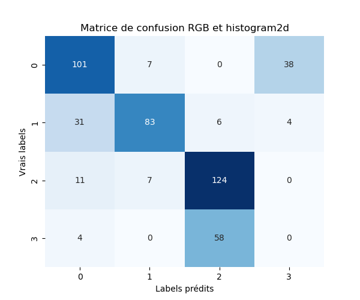

# Classification de la maturité des fraise (Strawberry Ripeness classification)

Le projet vise à améliorer la production industrielle des fraises.
On cherche à classer les fraises en quatre groupes de maturation : non-mûre, semi-mûre, presque mûre et mûre. On tente d'explorer deux approches : une non supervisée par K-means et l'autre supervisée par réseaux convolutifs CNN.

## Approche Non Supervisée Kmeans
La première méthode dans le dossier `Clustering` se base sur le clustering K-means dans différents espaces de couleurs : RGB, HSV et Lab. On classifie alors soit en utilisant la moyenne des couleurs soit l'histogramme 2d sur les canaux appropriés.

### Résultats Clustering

#### Clustering 

| HSV+Hist2D | Lab+Hist2D | RGB+Hist2D |
|---------|---------|---------|
|  |  |  |

| HSV+Mean | Lab+mean | RGB+mean |
|---------|---------|---------|
|  |  |  |

---
#### Matrice de confusion

| HSV+Hist2D | Lab+Hist2D | RGB+Hist2D |
|-----------|-----------|-----------|
|  |  |  |

| HSV+Mean  | Lab+mean  | RGB+mean |
|-----------|-----------|-----------|
|  |  |  |

---

#### Tableau des performances des modèles de clustering

| Modèles       | Silhouette | Inertie   | Accuracy | ARI    |
|---------------|------------|-----------|----------|--------|
| RGB + Hist2D  | 0.567      | 1876.132  | 0.650    | 0.434  |
| HSV + Hist2D  | 0.403      | 7467.483  | 0.487    | 0.181  |
| Lab + Hist2D  | 0.895      | 1637.634  | 0.312    | -0.003 |
| RGB + mean    | 0.394      | 1161.400  | 0.511    | 0.314  |
| HSV + mean    | 0.439      | 864.397   | 0.584    | 0.231  |
| Lab + mean    | 0.466      | 1027.567  | 0.679    | 0.404  |

## Approche Supervisée CNN
La deuxième méthode dans le dossier `CNN` utilise des réseaux convolutifs pour la classification. Plus précisément un fine-tuning est effectué sur resnet18 préentrainé pour correspondre à notre tâche.

### Résultats Classification

#### Perte + Accuracy

#### Area Under the Curve (AUCROC)

#### Matrice de confusion

